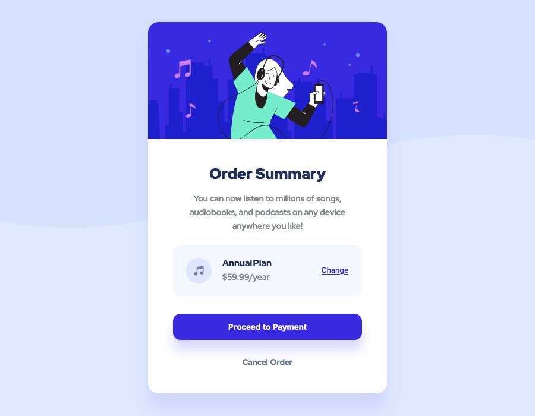

# Frontend Mentor - Order summary card solution

This is a solution to the [Order summary card challenge on Frontend Mentor](https://www.frontendmentor.io/solutions/responsive-order-summary-card-using-sassscss-H8PwPtElv). 
Frontend Mentor challenges help you improve your coding skills by building realistic projects. 

## Table of contents

- [Frontend Mentor - Order summary card solution](#frontend-mentor---order-summary-card-solution)
  - [Table of contents](#table-of-contents)
  - [Overview](#overview)
    - [The challenge](#the-challenge)
    - [Screenshot](#screenshot)
    - [Links](#links)
  - [My process](#my-process)
    - [Built with](#built-with)
    - [What I learned](#what-i-learned)
    - [Useful resources](#useful-resources)
  - [Author](#author)

## Overview

### The challenge

Users should be able to:

- See hover states for interactive elements

### Screenshot

### Links

- Solution URL: [www.frontendmentor.io/solutions/responsive-order-summary-card-using-sassscss-H8PwPtElv](https://www.frontendmentor.io/solutions/responsive-order-summary-card-using-sassscss-H8PwPtElv)
- Live Site URL: [order-summary-component-seven-gray.vercel.app/](https://order-summary-component-seven-gray.vercel.app/)

## My process

### Built with

- Semantic HTML5 markup
- CSS custom properties
- Flexbox
- SASS/SCSS
- Mobile-first workflow

### What I learned

This project was a good practice in terms of using:
- flex
- media queries
- BEM structure

### Useful resources

Firefox add-ons that I used to create a pixel perfect version of this website:
- [Pixel Perfect Pro](https://addons.mozilla.org/en-US/firefox/addon/pixel-perfect-pro/) - This helped me to display a screenshot on top of the webpage to easily check if dimensions were accurate.
- [PX: Viewport Dimensions](https://addons.mozilla.org/en-US/firefox/addon/px-viewport-dimensions/) - This add-on will show you the dimensions of your viewport while resizing your browser.

Other tools:
- [Gimp](https://www.gimp.org/) - This helped me resize screenshots provided in the project
- [Figma](https://www.figma.com) - This helped me create a rapid mockup to get dimensions of components.

## Author

- Frontend Mentor - [@melwynt](https://www.frontendmentor.io/profile/melwynt)
- Twitter - [@melwyntee](https://www.twitter.com/yourusername)
